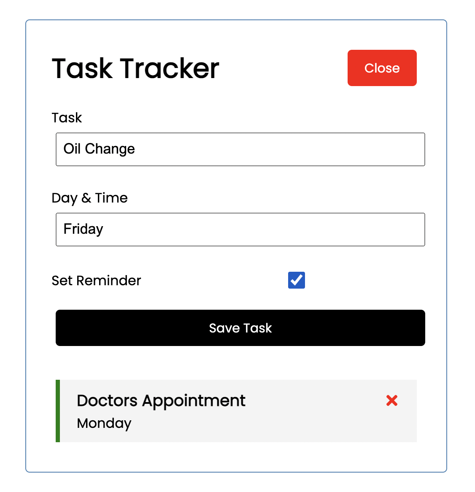
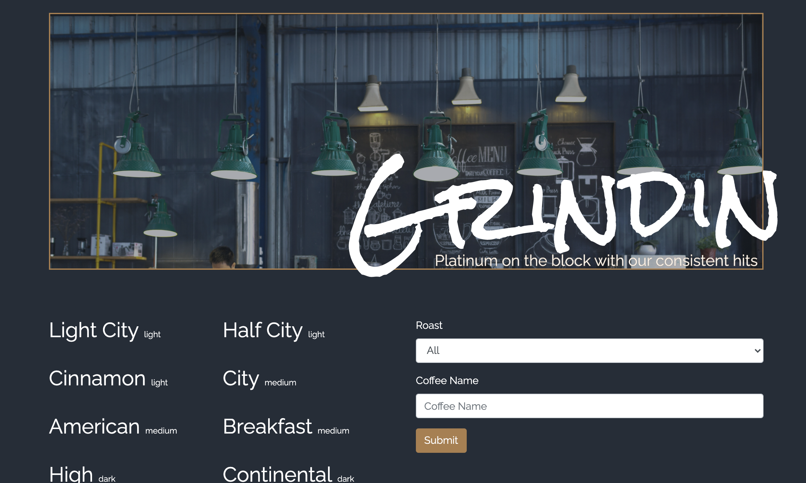

# Ann Michelle Gonzales
*Full Stack Web Developer*

# Education
* Certificate of Completion (Full Stack Web Development, Luna Cohort), *Codeup*, 2020-2021
* Bachelor of Arts (Philosophy), *University of Texas at San Antonio*, 2005-2009

# [Project 1: Personal Blog](http://annmichellegonzales.pythonanywhere.com/)

This project makes use of ***Django*** a Python framework to create a personal blog.

# [Project 2: BlogStar]

This project makes use of ***Spring Boot*** a Java framework coupled with ***Twitter Bootstrap*** to create a social media blog.

# [Project 2: Task Tracker]

This project makes use of ***React*** a JavaScript library used in Frondend Development.

# [Project 2: Grindin]

This project makes use of ***JavaScript*** and DOM manipulation to showcase the listings of a coffee shop.

