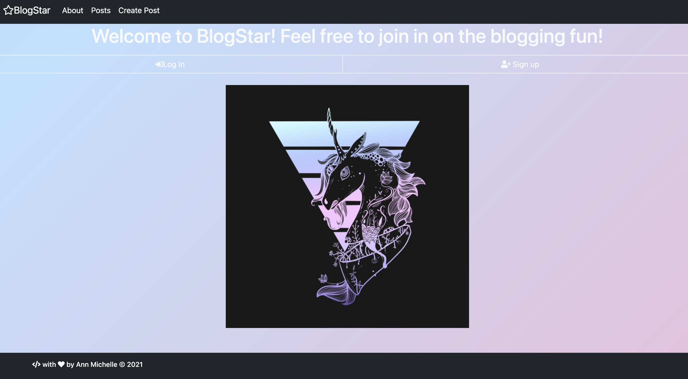
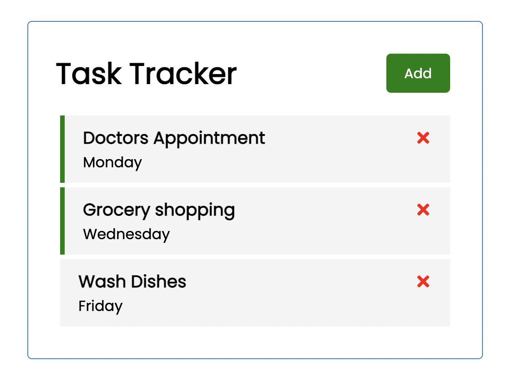

# Ann Michelle Gonzales
*Full Stack Web Developer*

# Education
* Certificate of Completion (Full Stack Web Development, Luna Cohort), *Codeup*, 2020-2021
* Bachelor of Arts (Philosophy), *University of Texas at San Antonio*, 2005-2009

# [Project 1: Crypto Sentiment Analysis](http://youtube.com/dataprofessor)

Photo by <a href="https://unsplash.com/@silverhousehd?utm_source=unsplash&utm_medium=referral&utm_content=creditCopyText">André François McKenzie</a> on <a href="https://unsplash.com/s/photos/cryptocurrency?utm_source=unsplash&utm_medium=referral&utm_content=creditCopyText">Unsplash</a>

This project integrates various news source for performing sentiment analysis pertaining to cryptocurrencies.
* **Python libraries used:** Streamlit, Huggingface, TensorFlow
* **Input:** Tweets, News
* **Output:** Sentiment of Cryptocurrency

# [Project 2: BlogStar](http://youtube.com/dataprofessor)

This project makes use of ***Spring Boot*** a Java framework coupled with ***Twitter Bootstrap*** to create a social media blog.

# [Project 2: Task Tracker](http://youtube.com/dataprofessor)
(react-addtask.png)

This project makes use of ***Spring Boot*** a Java framework coupled with ***Twitter Bootstrap*** to create a social media blog.

